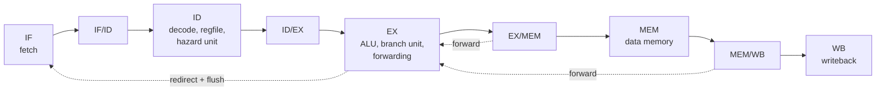

# RISC V Pipelined CPU


A five stage pipelined RV32I processor written from scratch in Verilog, with full hazard handling, performance counters, and a self checking test suite. Everything is simulated, no hardware needed.

Built by Madhav Agarwal, Computer Engineering at UC Irvine.

## Highlights

- Classic five stage pipeline: Fetch, Decode, Execute, Memory, Writeback
- **Forwarding** from the MEM and WB stages, so back to back dependent instructions run with no delay
- **Load use hazard detection** that stalls exactly one cycle when an instruction needs data a load hasn't returned yet
- **Branch and jump flushing** that cancels wrong path instructions on taken branches, `jal`, and `jalr`
- **Performance counters** for cycles, retired instructions, stalls, and flushes, used to measure CPI
- A single cycle version of the same CPU, kept as a reference to check the pipeline against
- 16 automated test suites, from individual modules up to full programs, run on every push with GitHub Actions

## Architecture



### Hazard handling

| Hazard | Example | Solution | Cost |
|---|---|---|---|
| Data | `add x1, ...` then `sub x4, x1, ...` | Forward the result from EX/MEM or MEM/WB | 0 cycles |
| Load use | `lw x2, 0(x0)` then `add x3, x2, x2` | Stall one cycle, then forward from WB | 1 cycle |
| Control | taken `beq`, `jal`, `jalr` | Predict not taken, flush 2 wrong path instructions | 2 cycles |

### Supported instructions

All RV32I computational, memory, and control instructions:
`lui auipc jal jalr beq bne blt bge bltu bgeu lb lh lw lbu lhu sb sh sw addi slti sltiu xori ori andi slli srli srai add sub sll slt sltu xor srl sra or and`

A store to address `0xFFFFFFF0` halts the CPU and freezes the counters (memory mapped I/O).

## Performance

On the `bench_sum` benchmark (fill an array, then sum it with a load and add loop):

| Metric | Value |
|---|---|
| Instructions | 87 |
| Cycles | 137 |
| Load use stalls | 10 |
| Taken branch flushes | 18 (36 cycles) |
| **CPI** | **1.575** |

Every cycle is accounted for: 87 instructions + 10 stalls + 36 flush cycles + 4 to fill the pipeline = 137. Branch flushes alone waste about 26% of all cycles, which is the target for branch prediction.

## Project structure

```
rtl/        CPU design
  cpu_pipe.v       five stage pipelined CPU (top level)
  cpu.v            single cycle reference CPU
  alu.v            arithmetic and logic
  regfile.v        32 registers, optional write through
  imm_gen.v        immediate decoding for all formats
  control.v        main control unit
  branch_unit.v    branch comparisons
  forward_unit.v   forwarding logic
  hazard_unit.v    load use stall detection
  instr_mem.v      instruction memory, loads hex programs
  data_mem.v       byte, halfword, and word access
  defines.vh       shared constants
tb/         self checking testbenches, one per module and program
programs/   hand assembled test programs and benchmarks (hex)
```

## Running the tests

Requires [Icarus Verilog](https://github.com/steveicarus/iverilog).

```bash
make test          # run every test suite
make cpu_pipe      # run one suite
make clean         # delete simulation output
```

Every testbench prints `ALL TESTS PASSED` on success, and `make` stops with an error if any suite fails.

To view waveforms, open any `.vcd` file from `sim/` in [Surfer](https://app.surfer-project.org) or GTKWave.

## Verification approach

- **Unit tests** for every module, focused on edge cases: signed vs unsigned compares, sign extension, shifting by more than 31, writes to x0, little endian byte access
- **Real instruction encodings** in every test instead of made up bit patterns
- **Program level tests** that target each hazard on purpose: back to back dependencies, every load use pattern, taken and not taken branches, and a function call and return
- **Performance checks**, not just correctness: tests assert exact stall, flush, and cycle counts
- **Reference comparison:** the pipeline runs the same program as the single cycle CPU and must produce identical results
- **Timeouts** so a CPU stuck in a loop fails the test instead of hanging
- **Continuous integration:** GitHub Actions runs every suite on each push

## Design decisions

- **Branches resolve in EX.** Simplest correct design, at the cost of 2 cycles per taken branch. Branch prediction is the next step.
- **Register file write through is a parameter.** The pipeline needs it so WB and ID can share a cycle. The single cycle CPU must turn it off, because there it creates a combinational loop.
- **Forwarding priority favors MEM over WB**, since MEM holds the newer value when both match.
- **`jal` and `jalr` forward PC+4**, not the ALU result, because that's the value they actually write.
- **ALU control codes match `{funct7[5], funct3}`**, which keeps the control logic small. Immediate instructions only use bit 30 for `srai`, since in `addi` that bit belongs to the immediate.
- **Valid bits travel with each instruction**, so the counters can tell real instructions apart from bubbles.

## Known limitations

- Memory accesses must be aligned
- No CSRs, exceptions, `ecall`, `ebreak`, or `fence`
- The load use stall can trigger on unused `rs2` bits (costs a cycle, never gives a wrong result)
- Memories use simulation only features (`$readmemh`, combinational reads)

## Roadmap

- [x] Single cycle RV32I CPU
- [x] Five stage pipeline with forwarding, stalls, and flushing
- [x] Continuous integration with GitHub Actions
- [x] Performance counters (cycles, instructions, CPI)
- [ ] Compile and run C programs with the RISC V GCC toolchain
- [ ] Branch prediction
- [ ] Instruction and data caches
- [ ] UART output and a tiny kernel