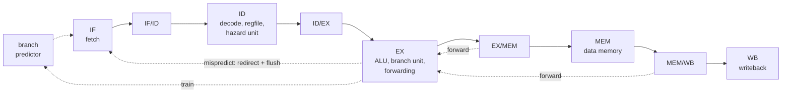

# RISC V Pipelined CPU


A five stage pipelined RV32I processor written from scratch in Verilog, with full hazard handling, branch prediction, performance counters, and a self checking test suite. It runs compiled C programs. Everything is simulated, no hardware needed.

Built by Madhav Agarwal, Computer Engineering at UC Irvine.

## Highlights

- Classic five stage pipeline: Fetch, Decode, Execute, Memory, Writeback
- **Forwarding** from the MEM and WB stages, so back to back dependent instructions run with no delay
- **Load use hazard detection** that stalls exactly one cycle when an instruction needs data a load hasn't returned yet
- **Branch prediction** with a 16 entry branch target buffer and 2 bit counters, cutting CPI by up to 20%
- **Performance counters** for cycles, retired instructions, stalls, flushes, and branches
- **Runs compiled C** using the RISC V GCC cross compiler, with custom startup code and linker script
- A single cycle version of the same CPU, kept as a reference to check the pipeline against
- 19 automated test suites, from individual modules up to full programs, run on every push with GitHub Actions

## Architecture



### Hazard handling

| Hazard | Example | Solution | Cost |
|---|---|---|---|
| Data | `add x1, ...` then `sub x4, x1, ...` | Forward the result from EX/MEM or MEM/WB | 0 cycles |
| Load use | `lw x2, 0(x0)` then `add x3, x2, x2` | Stall one cycle, then forward from WB | 1 cycle |
| Control | `beq`, `jal`, `jalr` | Predict in IF, check in EX, flush on a wrong guess | 0 cycles if right, 2 if wrong |

### Branch prediction

The fetch stage looks up every PC in a 16 entry **branch target buffer**. Each entry stores the branch's PC as a tag, its last target, and a **2 bit saturating counter**. If the counter says taken, fetch jumps straight to the stored target. The guess travels down the pipeline, and EX compares it with what really happened. A wrong direction or a wrong target flushes and redirects; a right guess costs nothing. Two surprises in a row are needed to flip a strong prediction, so a loop's single exit doesn't ruin the next run of the loop.

### Supported instructions

All RV32I computational, memory, and control instructions:
`lui auipc jal jalr beq bne blt bge bltu bgeu lb lh lw lbu lhu sb sh sw addi slti sltiu xori ori andi slli srli srai add sub sll slt sltu xor srl sra or and`

A store to address `0xFFFFFFF0` halts the CPU and freezes the counters (memory mapped I/O).

## Performance

| Program | CPI without prediction | CPI with prediction | Prediction accuracy |
|---|---|---|---|
| `bench_sum` (array fill and sum) | 1.575 | **1.253** | 80% |
| `fib(10)` (recursive C) | 1.336 | **1.153** | about 62% |

On `bench_sum` every cycle is accounted for. Without prediction: 87 instructions + 10 stalls + 36 flush cycles + 4 to fill the pipeline = 137. With prediction, flushes drop from 18 to 4 (just the first and last pass of each loop), giving 109 cycles.

`fib` predicts worse because of returns: it's called from two places, so its `ret` alternates targets, and the BTB only remembers the last one. A return address stack would fix this.

## Running C programs

C code in `sw/` is compiled with the RISC V GCC cross compiler and run directly on the CPU. A small startup file (`crt0.S`) sets the stack pointer, calls `main`, and halts. A linker script (`link.ld`) places code at address 0.

```bash
brew install riscv64-elf-gcc   # macOS
make c_fib                     # compile sw/fib.c and run it on the pipeline
```

The disassembled output is saved to `build/fib.dump`.

## Project structure

```
rtl/        CPU design
  cpu_pipe.v          five stage pipelined CPU (top level)
  cpu.v               single cycle reference CPU
  alu.v               arithmetic and logic
  regfile.v           32 registers, optional write through
  imm_gen.v           immediate decoding for all formats
  control.v           main control unit
  branch_unit.v       branch comparisons
  branch_predictor.v  branch target buffer with 2 bit counters
  forward_unit.v      forwarding logic
  hazard_unit.v       load use stall detection
  instr_mem.v         instruction memory, loads hex programs
  data_mem.v          byte, halfword, and word access
  defines.vh          shared constants
tb/         self checking testbenches, one per module and program
programs/   hand assembled test programs and benchmarks (hex)
sw/         C programs, startup code, and linker script
tools/      helper scripts (bin to hex conversion)
```

## Running the tests

Requires [Icarus Verilog](https://github.com/steveicarus/iverilog) and a RISC V GCC cross compiler.

```bash
make test          # run every test suite
make cpu_pipe      # run one suite
make clean         # delete simulation and build output
```

Every testbench prints `ALL TESTS PASSED` on success, and `make` stops with an error if any suite fails.

To view waveforms, open any `.vcd` file from `sim/` in [Surfer](https://app.surfer-project.org) or GTKWave.

## Verification approach

- **Unit tests** for every module, focused on edge cases: signed vs unsigned compares, sign extension, shifting by more than 31, writes to x0, little endian byte access, predictor hysteresis and tag conflicts
- **Real instruction encodings** in every test instead of made up bit patterns
- **Program level tests** that target each hazard on purpose: back to back dependencies, every load use pattern, taken and not taken branches, and a function call and return
- **Performance checks**, not just correctness: tests assert exact stall, flush, and cycle counts, with prediction on and off
- **Reference comparison:** the pipeline runs the same program as the single cycle CPU and must produce identical results
- **Every correctness test runs with prediction on**, proving a wrong guess never changes a result
- **Timeouts** so a CPU stuck in a loop fails the test instead of hanging
- **Continuous integration:** GitHub Actions compiles the C programs and runs every suite on each push

## Design decisions

- **Predict in IF, verify in EX.** Mispredicts cost the same 2 cycles as before, but correct guesses cost nothing.
- **Only taken branches are added to the BTB**, since "not taken" is already the default guess.
- **Full PC tags** in the BTB, so two branches sharing a slot are never confused.
- **A `USE_BP` parameter** turns prediction off, giving a fair before and after comparison on the same design.
- **Register file write through is a parameter.** The pipeline needs it so WB and ID can share a cycle. The single cycle CPU must turn it off, because there it creates a combinational loop.
- **Forwarding priority favors MEM over WB**, since MEM holds the newer value when both match.
- **`jal` and `jalr` forward PC+4**, not the ALU result, because that's the value they actually write.
- **ALU control codes match `{funct7[5], funct3}`**, which keeps the control logic small. Immediate instructions only use bit 30 for `srai`, since in `addi` that bit belongs to the immediate.
- **Valid bits travel with each instruction**, so the counters can tell real instructions apart from bubbles.

## Known limitations

- Returns predict poorly (no return address stack yet)
- Memory accesses must be aligned
- No CSRs, exceptions, `ecall`, `ebreak`, or `fence`
- No multiply or divide (RV32I only, no M extension)
- The load use stall can trigger on unused `rs2` bits (costs a cycle, never gives a wrong result)
- Memories use simulation only features (`$readmemh`, combinational reads)

## Roadmap

- [x] Single cycle RV32I CPU
- [x] Five stage pipeline with forwarding, stalls, and flushing
- [x] Continuous integration with GitHub Actions
- [x] Performance counters (cycles, instructions, CPI)
- [x] Compile and run C programs with the RISC V GCC toolchain
- [x] Branch prediction (BTB with 2 bit counters)
- [ ] Return address stack
- [ ] Instruction and data caches
- [ ] UART output and a tiny kernel